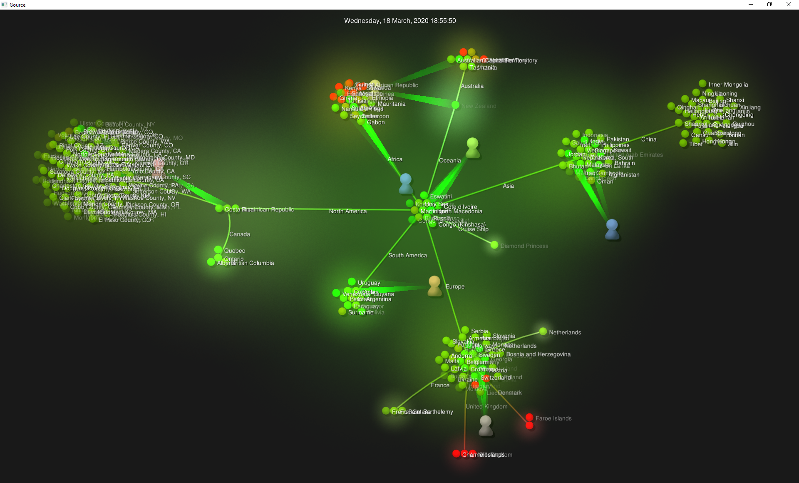

# Visualisation of Corona virus - COVID19

## Tutorial

1. Lunch converter 
~~~
Usage: converter covid.log
~~~

The application will download data automatically from:
- COVID-19 https://raw.githubusercontent.com/datasets/covid-19/master/time-series-19-covid-combined.csv
- Continents https://raw.githubusercontent.com/dbouquin/IS_608/master/NanosatDB_munging/Countries-Continents.csv
            
2. Lunch gource 

~~~ bash
gource covid.log -s 0.2
~~~

## Docs
https://github.com/acaudwell/Gource/wiki/Custom-Log-Format

## Future
Instead of parsing CSV data I'm going to switch to COVID19 API https://covid19api.com/
